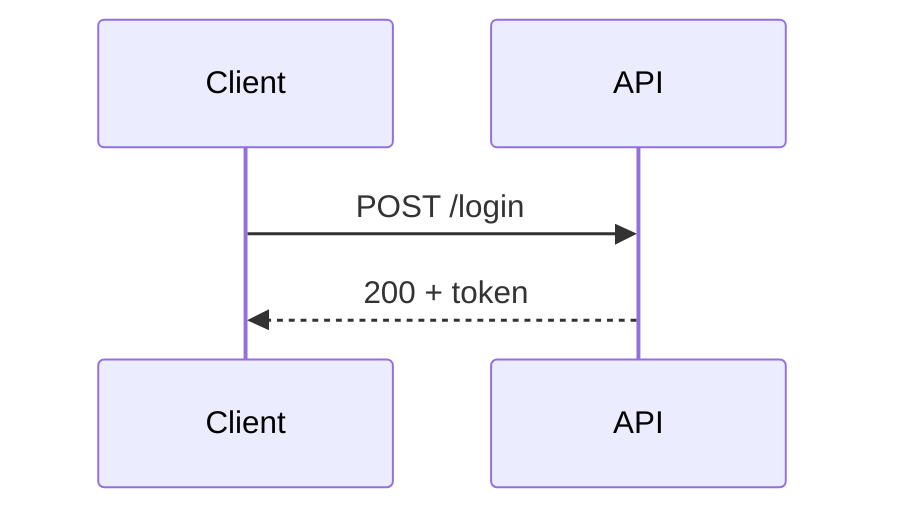
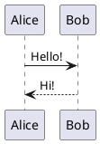

# 程式碼與圖表（code-and-diagrams）

適用：程式碼高亮/演化、從檔案匯入片段、流程/時序/UML 圖、數學式、自訂架構圖。

對應鐵則：#4（行高亮 + magic-move、不貼整坨）、#6（圖走程式碼、不截圖）。

核心心法：**程式碼用「聚焦 → 演化」兩招**（行高亮聚焦、magic-move 演化）；**圖一律用
程式碼生成**（Mermaid / PlantUML / KaTeX / inline SVG），絕不貼截圖。

## 1. 程式碼行高亮（聚焦）

Shiki 是內建 highlighter。在語言後的 `{}` 標要高亮的行，用 `|` 分段，每按一次 click
換一段（鐵則 #4）：

````md
```ts {2,3|5|all}
function add(a: number, b: number) {
  const sum = a + b
  return sum
}
const r = add(1, 2)   // 第 3 段才點亮這行
```
````

- `{2,3}`：同時高亮第 2、3 行。
- `{2,3|5|all}`：三段，逐 click 推進（最後 `all` 全亮）。
- 加 `{lines:true}` 顯示行號（或 headmatter `lineNumbers: true` 全域開）；起始行號用
  `{startLine:5}`，可合併 `{lines:true,startLine:5}`。
- `{maxHeight:'200px'}` 讓過長程式碼可捲動。

## 2. magic-move（演化）

要呈現「同一段程式碼從 A 演化成 B、C」用 magic-move，**四個反引號**包住多個程式碼區塊，
逐 click morph（鐵則 #4）：

`````md
````md magic-move {at:1}
```ts
const x = data.filter(Boolean)
```

```ts
const x = data.filter(Boolean).map(f)
```

```ts {2}
const x = data
  .filter(Boolean)
  .map(f)
```
````
`````

- 每個 code block 是一步，token 之間平滑變形。
- 區塊內仍可用行高亮（`{2}`）與 `{*|1|2-5}` 逐步高亮。
- ` ````md magic-move [app.ts] ` 加檔名標題列；`{duration:500}` 調速（全域
  `magicMoveDuration`，預設 800ms）。

## 3. 從檔案匯入片段（`<<<`）

長片段別整坨貼進 slide（鐵則 #4）——放 `snippets/`、用 `<<<` 匯入，原始碼可單獨維護：

```md
<<< @/snippets/server.ts                 // 整檔
<<< @/snippets/server.ts#route            // 只匯入 VS Code #region route 區段
<<< @/snippets/server.ts ts {2,3|5}{lines:true}   // 指定語言 + 行高亮 + 行號
```

`@` 指向專案根；**建議放 `@/snippets/`** 以相容 Monaco。`#region` 對應原始檔裡的
`// #region route … // #endregion route`。

## 4. TwoSlash 與 Monaco（型別與可編輯）

- **TwoSlash**：在 `ts` 後加 `twoslash`，渲染真實型別資訊（hover / inline），用 `// ^?`
  標記就地顯示推導型別。適合講 TypeScript 主題：

````md
```ts twoslash
const user = { name: 'amy', age: 30 }
//    ^?
```
````

- **Monaco 可編輯**：在語言後加 `{monaco}` 變成可編輯器、`{monaco-run}` 可執行、
  `{monaco-diff}` 比對（用 `~~~` 分隔前後）。可設 `{height:'300px'}`：

````md
```ts {monaco-run}
console.log('現場可改可跑')
```
````

> Monaco / `monaco-run` 主要用於現場互動；匯出靜態 PDF 時互動性會喪失，靜態場合優先用
> 行高亮或 magic-move（見 export-delivery.md）。

## 5. Mermaid（流程/時序/狀態圖）

程式碼即圖，`{}` 可帶 `theme` 與 `scale`（鐵則 #6）：

````md

````

支援 flowchart / sequenceDiagram / stateDiagram / classDiagram / erDiagram / gantt 等。

## 6. PlantUML（UML）

用 ` ```plantuml ` 包 `@startuml … @enduml`，預設送到 www.plantuml.com 算圖：

````md

````

要改算圖伺服器（離線/內網）：headmatter 設 `plantUmlServer: https://your-server`。

## 7. inline SVG 架構圖（可上色、可逐步點亮）

自訂架構圖直接寫 SVG（鐵則 #6）——能被 UnoCSS class 上色、能用 v-click 逐步揭示
（見 animation.md），比截圖可改、清晰、隨主題變色：

```md
<svg viewBox="0 0 300 80" class="w-80">
  <rect x="10" y="20" width="80" height="40" class="fill-blue-500/20 stroke-blue-500" />
  <text x="50" y="45" class="text-xs" text-anchor="middle" fill="currentColor">Web</text>
  <line x1="90" y1="40" x2="200" y2="40" class="stroke-gray-400" />
  <rect v-click x="200" y="20" width="80" height="40" class="fill-green-500/20 stroke-green-500" />
  <text v-click x="240" y="45" class="text-xs" text-anchor="middle" fill="currentColor">DB</text>
</svg>
```

## 8. KaTeX（數學式）

行內 `$…$`、區塊 `$$…$$`（鐵則 #6）。區塊可像程式碼一樣逐行高亮：

```md
質能等價：$E = mc^2$

$$ {1|2|all}
\begin{aligned}
\nabla \cdot \vec{E} &= \frac{\rho}{\varepsilon_0} \\
\nabla \cdot \vec{B} &= 0
\end{aligned}
$$
```

化學式（mhchem）需在 `vite.config.ts` 載擴充再用 `\ce{...}`：

```ts
// vite.config.ts
import 'katex/contrib/mhchem'
export default {}
```

## 9. code groups（多段程式碼分頁籤）

「同一件事、多種寫法」（npm/yarn/pnpm、JS/TS、前/後端）用 `::code-group` 收成頁籤，
別並排貼多塊。**需 headmatter `comark: true`**（這是獨立旗標，**不是** `mdc: true`）：

````md
::code-group

```sh [npm]
npm i @slidev/cli
```

```sh [pnpm]
pnpm add @slidev/cli
```

::
````

- `[方括號]` 內是頁籤標題；標題名會自動配對圖示（內建圖示需裝 `@iconify-json/vscode-icons`）。
- 自訂圖示：標題後加 `~i-uil:github~`，並裝該 iconify 套件、在 `uno.config.ts` 的 `safelist` 加 `i-uil:github`（icons 細節見 [theming-style.md](theming-style.md)）。
